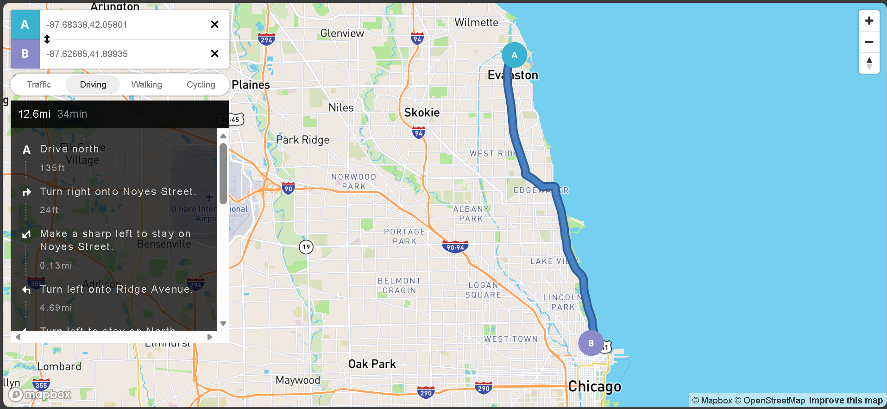

# Google Maps Clone

A simple map application built with Mapbox GL JS — includes directions and navigation controls.

## Screenshot



## Getting Started

### Prerequisites

- A [Mapbox](https://www.mapbox.com/) account and access token
- Node.js (for generating the config from `.env`)

### Setup

1. Clone the repo and go to the project folder.

2. Copy the example env file and add your Mapbox token:
   ```bash
   cp .env.example .env
   ```
   Edit `.env` and set:
   ```
   MAPBOX_ACCESS_TOKEN=your_mapbox_access_token_here
   ```

3. Generate the browser config (reads `.env` and creates `env.config.js`):
   ```bash
   node generate-config.js
   ```

4. Open `index.html` in your browser, or use a local server (e.g. Live Server).

### Run again later

After changing the token in `.env`, run:

```bash
node generate-config.js
```

Then refresh the page.

## Author

- **Author:** Tamara Tava
- **LinkedIn:** https://www.linkedin.com/in/tamara-tava/
